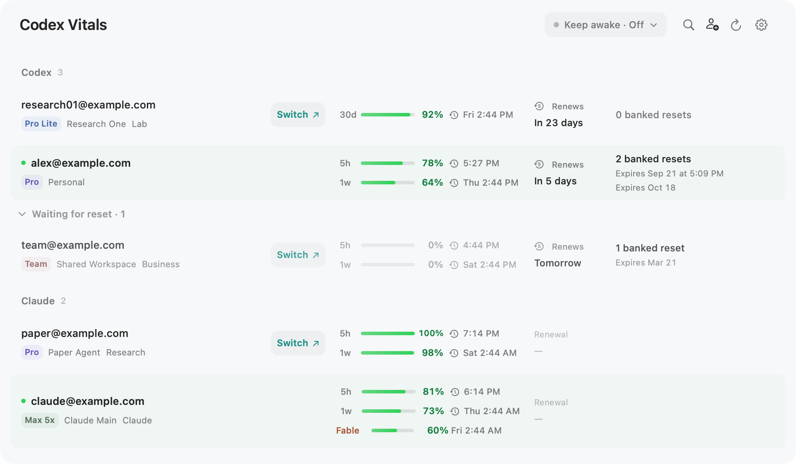

# Codex Vitals: Codex and Claude account usage from the menu bar

**Keystone Science — Nathan Stone and Jackson Stone**

See [personal macOS builds](docs/LOCAL_DEVELOPMENT.md) for build commands, update sources, and verification of the borderless interface.

<p align="center">
  
  
  
  <a href="https://github.com/Joowonoil/Codex-Vitals/releases/latest">
    
  </a>
  
</p>

<p align="center">
  An unofficial, local-first app for monitoring Codex and Claude usage with explicit manual account switching.
</p>

<p align="center">
  <a href="https://github.com/Joowonoil/Codex-Vitals/releases/download/v1.6.3/CodexVitals-1.6.3.dmg"><strong>Download for macOS</strong></a>
  &nbsp;&nbsp;·&nbsp;&nbsp;
  <a href="https://github.com/Joowonoil/Codex-Vitals/releases/download/windows-v1.0.0/CodexVitals-Windows-1.0.0-Setup.exe"><strong>Download for Windows</strong></a>
</p>

<p align="center">
  
</p>

## Overview

**Codex Vitals** helps you monitor OpenAI Codex usage, reset windows, account state, and workspaces from the macOS menu bar or Windows system tray. On macOS it also manages Claude Code accounts natively. Codex and Claude remain independently signed in and switch independently.

- View best-effort Codex quota and usage across all your accounts
- On macOS, see each Codex account's banked reset count and every known expiration date and time in a separate read-only column on the far right
- Group accounts by workspace/team
- Add local display aliases so personal accounts are easy to identify
- Choose Usage or Manual account order and drag rows into place; the first successful drop automatically enables Manual order
- Instantly see which account is active
- Switch the active account used by Codex CLI and the desktop app with one click
- View Claude 5-hour and 7-day limits, available Fable 5 weekly usage, detected plans, workspace labels, and optional plan renewal dates on macOS
- Reorder, group, reconnect, hide, and explicitly switch saved Claude Code accounts independently of Codex
- Enable Launch at Login from the settings panel
- Tune automatic refresh cadence from the settings panel
- Enable grouped notifications on macOS after automatic refresh confirms that Codex or Claude usage has reset
- Check for signed app updates and enable automatic installation
- Identify invalid or deactivated accounts

> **Disclaimer:** Codex Vitals is not affiliated with OpenAI or Anthropic. It does not change provider limits, share accounts, or automate account cycling. It only helps you view local usage state and manually switch between accounts you control.

## Features

- **Codex Quota Dashboard** — Best-effort usage tracking across all linked accounts
- **Banked Reset Visibility on macOS** — Show each Codex account's available count and individual expiration times in a clearly labeled, non-clickable read-only column; the app has no control that redeems a reset
- **Workspace Grouping** — Accounts organized by team/workspace
- **Display Aliases** — Local-only account labels for easier scanning while preserving the real email for auth and copy actions
- **Account Health** — Visual indicators for invalid or deactivated accounts
- **One-Click Switching** — Apply a saved account to Codex CLI and the supported desktop app
- **Claude Accounts on macOS** — Add, label, group, reorder, monitor 5-hour, 7-day, and available Fable 5 weekly limits, reconnect, hide, and explicitly switch Claude Code accounts inside Codex Vitals
- **Claude Plan Context** — Detect available Claude plan metadata and optionally show a locally entered plan renewal date
- **Passive Auth Mirroring** — Codex-managed token rotations are mirrored back into saved local profiles
- **Local-First** — All data stays on your machine; no cloud sync
- **Secure Token Storage** — Saved Claude credentials use the macOS Keychain; sensitive Codex files use owner-only permissions
- **Settings Panel** — Manage Launch at Login, usage refresh, reset notifications, and application updates inside the menu bar popover
- **Signed Automatic Updates** — Sparkle on macOS and WinSparkle on direct Windows builds verify EdDSA signatures before installation
- **Network-Friendly Refresh** — Automatic usage refresh defaults to 10 minutes, Claude requests use a 15-minute minimum and honor Anthropic backoff, and metadata is cached
- **Usage or Manual Ordering** — Keep the usage-based recommendation order or drag rows into a persistent manual order, independently within Codex and Claude

## Check, Switch, and Continue

Codex Vitals is designed for using several accounts in rotation without losing track of your work:

1. **Check remaining usage** — Compare the quota left on every saved account and find one with capacity.
2. **Press the switch button** — Choose that account directly from the menu bar list.
3. **Use it in the CLI and desktop app** — The selected account becomes active for new Codex CLI runs and for ChatGPT on macOS or Codex Desktop on Windows.
4. **Continue the same conversation** — Session history is stored locally, so `/resume` or `codex resume` can reopen earlier work even after the account changes.

The conversation and workspace context remain available, while new requests use the switched account's limits and permissions. Switching is always manual. Codex Vitals backs up the local state before applying the selected profile and relaunches the supported desktop app; a running CLI session may close during the handoff.

## Account Ordering

Choose **Usage** in Settings to keep the best account to use now near the top, or choose **Manual** to preserve your own order. Dragging a row automatically switches to Manual.

- **Smart score** — Uses the lowest remaining balance among the quota windows currently reported by OpenAI; the account with the highest bottlenecked balance wins.
- **Reset Soon strip** — In Usage order, accounts with useful balance whose weekly window resets in less than 24 hours appear in a dedicated top section.
- **Manual order** — Drag rows within Codex or Claude to persist a provider-specific order. With workspace grouping enabled, rows stay inside their current workspace.
- **Exhausted accounts** — Sorted by who resets first, so you know which one will be usable again soonest.
- **Free reset group** — Free-plan accounts waiting for session reset are grouped separately so daily-use paid/workspace accounts stay easier to scan.

## Requirements

- **macOS:** macOS 13 or newer; ChatGPT installed as `ChatGPT.app`, or the legacy `Codex.app`
- **Windows:** 64-bit Windows 10 or 11; Codex Desktop for desktop-session switching
- A Codex CLI installation and accounts you control
- **Optional Claude support on macOS:** Claude Code installed and available to your user account

## Installation

### macOS

Download the latest `.pkg` from [Releases](../../releases), double-click to run the installer, and Codex Vitals will be installed to `/Applications`.

To add a Claude account, open Codex Vitals, choose the account-add button, and select **Add Claude Account**. The app starts the official `claude auth login` browser flow, then stores that account's saved credential in its own macOS Keychain service. Switching remains a manual action; Codex Vitals does not automatically rotate accounts.

### Windows

Download [`CodexVitals-Windows-1.0.0-Setup.exe`](https://github.com/Joowonoil/Codex-Vitals/releases/download/windows-v1.0.0/CodexVitals-Windows-1.0.0-Setup.exe) and run it. The current direct installer is not Authenticode-signed, so Microsoft Defender SmartScreen may show a warning. Choose **More info** and **Run anyway** only for the installer downloaded from this repository or [ramterstudio.com](https://ramterstudio.com/codex-vitals/).

### Build From Source

```bash
git clone https://github.com/KeystoneScience/codex-vitals.git
cd codex-vitals
swift test
swift build
./build-app.sh
open dist/CodexVitals.app
```

### Building the Installer

To generate a `.pkg` installer from the built app:

```bash
./build-app.sh
./build-pkg.sh
```

The installer will be created at `dist/CodexVitals-<version>.pkg`.

Windows build and installer instructions are in [windows/README.md](windows/README.md).

Sparkle release feeds are generated after a signed and notarized DMG is ready:

```bash
scripts/prepare-sparkle-update.sh <version> dist/CodexVitals-<version>.dmg [release-notes.md]
```

## Data & Privacy

Codex Vitals is local-first and never syncs tokens or exposes a remote service.

### Local Files

| Path | Purpose |
|------|---------|
| `~/Library/Application Support/CodexVitals/accounts.json` | Account list |
| `~/Library/Application Support/CodexVitals/profiles/<profile>/auth.json` | Profile tokens |
| `~/Library/Application Support/CodexVitals/profiles/<profile>/meta.json` | Profile metadata |
| `~/Library/Application Support/CodexVitals/accounts-snapshot.json` | Usage snapshots |
| `~/Library/Application Support/CodexVitals/team-name-cache.json` | Team name cache |
| `~/Library/Application Support/CodexVitals/backups/<timestamp>-remove-account/` | Backups before removal |
| macOS Keychain: `com.ramterstudio.CodexVitals.Claude` | Saved Claude credentials |
| `~/Library/Application Support/CodexVitals/claude-accounts.json` | Non-secret Claude aliases, ordering, workspace labels, visibility, plan metadata, and optional renewal dates |
| `~/.claude.json` and Keychain: `Claude Code-credentials` | Active Claude Code account state; Codex Vitals changes only the active account metadata and credential during a manual switch |
| `%APPDATA%\CodexVitals\` | Windows accounts, snapshots, settings, and local backups |

All sensitive files are written with `0600` permissions. Codex profile removal creates a local backup before deleting profile data. Removing an inactive Claude profile deletes its saved app credential and metadata; removing the currently active Claude profile only hides it from Codex Vitals and leaves Claude Code signed in. Re-adding the active account restores it to the list.

### Network Calls

The app uses your local Codex/OpenAI auth tokens to query:

- `https://chatgpt.com/backend-api/codex/usage`
- `https://chatgpt.com/backend-api/wham/rate-limit-reset-credits`
- `https://chatgpt.com/backend-api/accounts/check/v4-2023-04-27`
- `https://auth.openai.com/oauth/authorize`
- `https://auth.openai.com/oauth/token`
- `https://ramterstudio.com/codex-vitals/appcast.xml` for application update metadata
- `https://ramterstudio.com/codex-vitals/windows-appcast.xml` for direct Windows update metadata
- GitHub Releases for signed application update downloads

For Claude support on macOS, the app uses the official Claude Code CLI for interactive browser login, Anthropic's OAuth usage endpoint for quota reads, and Anthropic's OAuth token endpoint to refresh expiring inactive saved accounts. Manual switching updates Claude Code's local active credential and only the `oauthAccount` field in `~/.claude.json`, then verifies the result or rolls it back.

- `https://api.anthropic.com/api/oauth/usage`
- `https://platform.claude.com/v1/oauth/token`

These are not official public APIs and may change without notice.

The banked-reset endpoint is queried with `GET` only. Codex Vitals displays the returned count and expiration metadata but provides no reset-redemption action.

Automatic usage refresh defaults to 10 minutes. Account metadata is cached for 6 hours during automatic refreshes. Manual refresh requests fresh Codex usage and metadata immediately; Claude usage remains limited to once per account every 15 minutes and honors Anthropic `Retry-After` responses while retaining the last successful reading.

Application update checks are separate from account refreshes. Sparkle and WinSparkle check at most once every 24 hours by default, and automatic checks can be changed in Settings. Microsoft Store builds leave updates to the Store.

### Security

- Bearer tokens are never logged or transmitted to third parties
- OAuth callback server binds only to `localhost:1455` and closes immediately after login
- Claude browser login launches only the fixed official `claude auth login --claudeai` command without a shell
- Claude credentials are never placed in process arguments, metadata files, snapshots, or logs
- See [SECURITY.md](SECURITY.md) for the full threat model

## FAQ

### Does Codex Vitals work with OpenAI Codex?

Yes. Codex Vitals is built for local OpenAI Codex account usage visibility and manual account switching on macOS and Windows.

### Does it track Codex quota and reset windows?

It shows best-effort Codex usage and reset timing from the local app using your existing Codex/OpenAI auth state. The underlying endpoints are not official public APIs and may change.

### Does it switch Codex accounts automatically?

No. Codex Vitals does not automate account cycling. It only changes the active local Codex account after an explicit manual action.

### Does account switching work in both the CLI and desktop app?

Yes. Check which account still has capacity, press its switch button, and Codex Vitals applies it to new Codex CLI runs and to ChatGPT on macOS or Codex Desktop on Windows.

### Will switching accounts remove my Codex sessions?

No. Session history remains stored locally, so earlier conversations can be reopened with `/resume` or `codex resume` after switching. The conversation continues, while new requests run under the account that is active when the session is resumed.

### Does it upload tokens or account data?

No. Codex Vitals is local-first and does not sync tokens, account data, or usage snapshots to a third-party service.

### How does Claude support work?

On macOS, Codex Vitals imports the currently active Claude Code account, stores saved account credentials in an app-specific Keychain service, and queries best-effort 5-hour and 7-day usage. When Anthropic reports a scoped Fable 5 limit, the app also shows its weekly remaining usage and reset time in a separate detail row. Available account metadata is used to display the Claude plan, while an optional plan renewal date can be entered locally. Accounts can be grouped into named workspaces and reordered. Adding or reconnecting uses Claude Code's official browser login. Switching is explicit and transactional, affects Claude Code only, and preserves unrelated `~/.claude.json` settings. Claude support is not yet included in the Windows build.

## Contributing

Issues and pull requests are welcome. Please keep changes local-first, avoid token logging, and run the platform-specific tests before opening a PR.

Codex Vitals is maintainer-led and provided on a best-effort basis. Response times and the inclusion of proposed changes are not guaranteed.

See [CONTRIBUTING.md](CONTRIBUTING.md) for guidelines.

## License

[MIT](LICENSE)

The distributed apps include Sparkle or WinSparkle under their bundled license notices. Claude integration attribution is included in [THIRD-PARTY-NOTICES.txt](THIRD-PARTY-NOTICES.txt).
